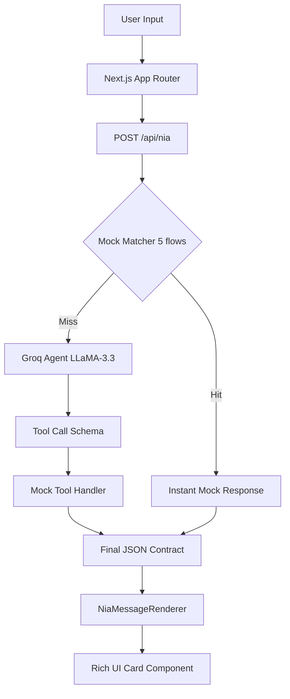

<div align="center">
  <h1>🛒✨ Nia — Now Intelligent Assistant</h1>
  <p><em>Delivery got fast. Deciding does too.</em></p>
  <p>Built for [HACKON] · [15 June 2026] · Team [BitMoggers]</p>
  
  <p>
    
    
    
    
    
    
  </p>

  <h3><a href="[VERCEL_DEPLOY_URL]">▶ Try the Live Demo →</a></h3>
</div>

---

<div align="center">
  <a href="[DEMO_VIDEO_URL]">
    
  </a>
  <p><em>Nia building a movie-night cart in under 2 seconds. Replace [DEMO_THUMBNAIL.png] with a screenshot of the app with a play button overlaid, linking to [DEMO_VIDEO_URL].</em></p>
</div>

<div align="center">
  
  
  
</div>

> Quick-commerce solved the last mile. Nobody solved the first 30 seconds.

Today's shopping flow requires 6 steps: search, browse, filter, compare, decide, cart, checkout. When you have a sick kid at 11pm or guests arriving in 20 minutes, 6 steps is 5 too many.

Nia collapses these steps into one sentence. Built for amazon.in/now, Nia understands intent, compares options, and builds complete carts instantly.

### Consumer Features
- 🧠 **Natural-language shopping** — type "movie night for 4 under ₹500", get a ready cart
- ⚡ **Smart Cart Builder** — intent → full editable cart in one sentence
- 🔍 **AI Comparison** — "best earbuds under ₹2000 with bass" → side-by-side card, best-pick badge
- 🚨 **Emergency Mode** — 8 categories (fever, baby care, surprise guests...) → curated kit + ETA
- 🔄 **Reorder Rituals** — recurring bundles detected automatically, one-click reorder
- 📉 **Predictive Reorder** — consumption cycle learning, "your milk runs out in 2 days" nudge
- 🔀 **Smart Substitutions** — out-of-stock item → Nia proposes equivalent, doesn't cancel
- 🌐 **Hinglish support** — responds in the same Hindi/English mix the user wrote in
- 🎯 **Confidence scores** — every AI recommendation shows match % + plain-English reason

---

### Seller Features ("Nia for Sellers")
- 📊 **Intent Gap Analytics** — see 1,200+ weekly queries customers typed that matched no product
- 💬 **Listing Optimization Chat** — chat with Nia to rewrite titles using real customer language
- 📈 **Nia Attribution Dashboard** — see exactly how many orders came from Nia recommendations
- 🏆 **Merit-based discovery** — Nia recommends on fit-to-intent, not ad spend

## How Nia is Different

| | Traditional Search | Other AI Assistants | Nia |
|---|---|---|---|
| **Input** | Keywords only | Broad Q&A | Full intent & constraints |
| **Output** | Endless scrolling lists | Text paragraphs | Actionable, editable carts |
| **Language** | English focus | Variable support | Fluent Hinglish mix |
| **Context** | Single item | General advice | Occasion & bundle based |
| **Sellers** | Guesswork & ads | Black box | Clear intent gap analytics |

## Architecture



### Why We Chose X

| Decision | Chose | Over | Reason |
|---|---|---|---|
| **AI Provider** | Groq (free) | Amazon Bedrock | Zero cost, 500 tok/s, identical OpenAI schema → 1-line production swap |
| **Demo strategy** | Mock-first routing | Live AI for all queries | 5 demo flows are instant + infallible; Groq handles everything else |
| **Framework** | Next.js 14 App Router | Create React App / Vite | Server components for SEO, API routes for /api/nia, single repo |
| **State** | Zustand | Redux / Context | Zero boilerplate, works across persistent NiaWidget on navigation |
| **Styling** | Tailwind | CSS Modules / Styled Components | Speed — 48h build leaves no time for CSS architecture debates |
| **Charts** | Recharts | D3 / Chart.js | React-native, tree-shakeable, works with Tailwind layout |
| **Animation** | Framer Motion | CSS transitions only | Panel open/close and card entrance needed spring physics |

### Tech Stack

| Layer | Technologies |
|---|---|
| **Frontend** | Next.js 14, React 18, TypeScript, Tailwind CSS, Zustand, Framer Motion, Recharts |
| **AI Backend** | Groq API (llama-3.3-70b-versatile), OpenAI-compatible schemas |
| **Data Layer (Mock)** | In-memory Zustand stores, client-side semantic search, consumption rules |
| **Infrastructure** | Vercel |

### Folder Structure

```text
nia-amazon-now/
├── app/
│   ├── api/nia/route.ts          # POST /api/nia — Groq agent loop + mock matcher
│   ├── compare/page.tsx          # Full comparison page (/compare?ids=...)
│   ├── emergency/page.tsx        # Emergency Mode — 8 kit categories
│   ├── rituals/page.tsx          # Saved reorder bundles
│   ├── seller/
│   │   ├── layout.tsx            # Auth guard + sidebar
│   │   ├── page.tsx              # Seller dashboard
│   │   ├── login/page.tsx
│   │   ├── intent-gaps/page.tsx  # Intent Gap Analytics
│   │   ├── listings/page.tsx
│   │   ├── optimization/page.tsx # Nia-powered listing optimizer
│   │   └── analytics/page.tsx
│   └── page.tsx                  # Consumer landing page
├── components/
│   ├── layout/
│   │   ├── TopBar.tsx
│   │   └── MiniCart.tsx
│   ├── NiaWidget/
│   │   ├── NiaTrigger.tsx        # Floating button with proactive badge
│   │   ├── NiaPanel.tsx          # Chat panel (sidebar/drawer)
│   │   ├── NiaMessageRenderer.tsx
│   │   └── cards/
│   │       ├── CartSummaryCard.tsx
│   │       ├── ComparisonCard.tsx
│   │       ├── EmergencyKitCard.tsx
│   │       ├── ProductListCard.tsx
│   │       └── ReorderNudgeCard.tsx
│   └── seller/
│       ├── Sidebar.tsx
│       └── AuthGuard.tsx
├── lib/
│   ├── stores/
│   │   ├── useNiaStore.ts        # Chat state + sendMessage action
│   │   ├── useCartStore.ts       # Global cart (all "Add" buttons write here)
│   │   └── useUserStore.ts       # Current user profile + pincode
│   ├── niaBrain/
│   │   ├── systemPrompt.ts       # Nia's persona + JSON response contract
│   │   ├── tools.ts              # 8 tool definitions (OpenAI function-calling schema)
│   │   └── mockTools.ts          # Mock handlers — 20 products, 3 kits, 1 user profile
│   ├── catalog/searchEngine.ts   # Client-side semantic search
│   ├── comparisons/compareEngine.ts
│   ├── cart/cartBuilder.ts
│   ├── emergency/categories.ts
│   └── personalization/consumptionEngine.ts
├── types/index.ts                # Single source of truth for ALL shared types
└── .env.local                    # GROQ_API_KEY only
```

## Quick Start

1. **Prerequisites**
```bash
node -v # requires v18+
npm -v
```

2. **Clone**
```bash
git clone [GITHUB_REPO_URL]
cd nia
```

3. **Install**
```bash
npm install
```

4. **Environment setup**
Create a `.env.local` file in the root directory.
```env
GROQ_API_KEY=gsk_xxxxxxxxxxxxxxxx
```
*Note: Get a free key from console.groq.com. No credit card required. The 5 seeded demo flows work entirely without this key.*

5. **Run**
```bash
npm run dev
```

6. **Open browser**
Visit these URLs to see the core features:
- Consumer App: `http://localhost:3000`
- Emergency Hub: `http://localhost:3000/emergency`
- Seller Console: `http://localhost:3000/seller`

> **Demo Credentials**
> 
> **Consumer:** No login needed — just open `localhost:3000`.
> 
> **Seller:** `localhost:3000/seller/login`
> - Email: `seller@techzone.in`
> - Password: `demo123`

## Demo Walkthrough

<details>
<summary>🎬 Flow 1: Movie Night Cart</summary>

1. Open Nia by clicking the floating ✨ button.
2. Type: `"Movie night for 4 under ₹500"`
3. Expected Result: A CartSummaryCard appears containing 6 curated items totaling ~₹290 with a ~10 min delivery ETA.
4. Follow-up: Type `"make it cheaper"` to see Nia refine the cart with a lower total.
<br>

</details>

<details>
<summary>⚖️ Flow 2: AI Comparison</summary>

1. Open Nia.
2. Type: `"best wireless earbuds under ₹2000 good bass"`
3. Expected Result: A ComparisonCard displays 3 products side-by-side. The boAt Airdopes will be highlighted as the best pick with a 91% confidence score.
<br>

</details>

<details>
<summary>🚨 Flow 3: Emergency Mode</summary>

1. Click the red "Emergency?" banner at the top of the screen, or navigate to `/emergency`.
2. Tap "Fever & Illness 🤒".
   *(Alternative: Type `"I have a fever"` directly into Nia).*
3. Expected Result: An EmergencyKitCard shows 5 essential items totaling ~₹312 with an expedited ~12 min delivery ETA and an "Order Now" CTA.
<br>

</details>

<details>
<summary>🎂 Flow 4: Birthday Party Kit</summary>

1. Open Nia.
2. Type: `"birthday party for 10 kids"`
3. Expected Result: A full party cart is instantly built with 8 relevant items totaling ~₹660.
<br>

</details>

<details>
<summary>📈 Flow 5: Seller Opportunity</summary>

1. Go to `localhost:3000/seller/login` and log in with `seller@techzone.in` / `demo123`.
2. Open the Dashboard and click **Intent Gaps**.
3. Find the gap `"sugar-free protein bar under ₹300"` (shows 1,247 weekly searches).
4. Click **Fix listing**.
5. Expected Result: The Optimization Chat opens pre-loaded with the query, ready to help the seller adjust their listing to capture this unmet demand.
<br>

</details>

<details>
<summary>📡 POST /api/nia — Full Reference</summary>

**Request Shape**
```json
{
  "messages": [
    { "role": "user", "content": "movie night for 4" }
  ],
  "userId": "priya-sharma-001",
  "userName": "Priya",
  "pincode": "110001"
}
```

**Response Shape: Text**
```json
{
  "type": "text",
  "content": "Sure, what kind of movies do you like?",
  "data": null
}
```

**Response Shape: Product List**
```json
{
  "type": "product_list",
  "content": "Here are some snacks.",
  "data": [
    { "id": "p1", "name": "Chips", "price": 50, "image": "...", "qty": 1 }
  ]
}
```

**Response Shape: Comparison**
```json
{
  "type": "comparison",
  "content": "Here is how they compare.",
  "data": {
    "query": "earbuds",
    "products": [
      { "id": "e1", "name": "boAt", "price": 1499, "matchScore": 91, "recommended": true }
    ],
    "attributes": ["bass", "battery"]
  }
}
```

**Response Shape: Cart Summary**
```json
{
  "type": "cart_summary",
  "content": "I built a cart for you.",
  "data": [
    { "id": "p1", "name": "Popcorn", "price": 99, "qty": 2 }
  ]
}
```

**Response Shape: Emergency Kit**
```json
{
  "type": "emergency_kit",
  "content": "Get well soon.",
  "data": {
    "category": "Fever",
    "name": "Fever Kit",
    "items": [],
    "totalPrice": 312,
    "eta": "12 mins"
  }
}
```

**Tool Definitions (OpenAI Schema)**

| Action Group | Purpose |
|---|---|
| `search_catalog` | Search vector DB for products matching keywords |
| `compare_products` | Analyze 2-4 products side-by-side |
| `build_cart` | Generate multi-item bundles based on intent |
| `check_inventory_eta` | Verify stock and delivery times for a pincode |
| `get_user_profile` | Fetch dietary needs, order history, saved rituals |
| `track_order` | Get live status of an active delivery |
| `apply_substitution` | Find equivalent items when stock is zero |
| `generate_emergency_kit` | Assemble priority items for urgent scenarios |

</details>

## Known Limitations

The following are conscious scope decisions for the 48-hour build window, not bugs. Each has a documented production path.

| Feature | Demo behaviour | Production path |
|---|---|---|
| **Checkout** | Toast: "not available in demo" | Amazon Pay + address book + 1-tap confirm |
| **Inventory & ETA** | Mock (seeded data) | Amazon Now dark-store inventory API |
| **Consumer auth** | No login required | Amazon account OAuth (same as amazon.in) |
| **AI responses** | Mock-first for 5 flows, Groq for others | Amazon Bedrock (Claude Sonnet) — 1-line swap |
| **Push notifications** | Only while tab is open | Web Push API + SNS background delivery |
| **Visual search** | Mic/camera buttons visible, not functional | Bedrock multimodal + Rekognition |
| **Voice output** | Not implemented | Amazon Polly TTS |
| **Streaming responses** | Full response after ~1.2s delay | SSE streaming from Groq/Bedrock |

## Roadmap

**Shipped in 48h:**
- [x] Nia chat widget (persistent floating panel, all pages)
- [x] Smart Cart Builder (intent → full cart in one sentence)
- [x] AI Product Comparison (side-by-side card, confidence score)
- [x] Emergency Mode (8 categories, curated kits, ETA)
- [x] Reorder Rituals (detected automatically, one-click reorder)
- [x] Predictive Reorder ("running low" row with consumption cycles)
- [x] Smart Substitutions (out-of-stock → Nia proposes equivalent)
- [x] Seller Console (Dashboard, Intent Gaps, Listings, Analytics, Auth)
- [x] Optimization Chat for sellers (Groq-powered listing improvement)
- [x] Hinglish support + confidence scores on all recommendations
- [x] Full mobile responsiveness (375px verified)
- [x] Groq integration (free tier, function calling, mock-first routing)

**Phase 2 (post-hackathon):**
- [ ] Real checkout (Amazon Pay integration)
- [ ] Live inventory (Amazon Now dark-store API)
- [ ] Consumer login (Amazon account OAuth)
- [ ] Voice mode (Web Speech API input + Amazon Polly output)
- [ ] Visual search (Bedrock multimodal + Rekognition)
- [ ] Streaming responses (SSE token-by-token rendering)
- [ ] Production migration: Groq → Amazon Bedrock (Claude Sonnet)
- [ ] Push notifications (Web Push + SNS)

**Phase 3 (scale):**
- [ ] Nia as API product (conversational commerce API via AWS Marketplace)
- [ ] Alexa integration (start cart on Alexa, finish on web)
- [ ] Autonomous reordering ("set it and forget it" households)
- [ ] Sustainability features (Renewed alternatives suggested by Nia)

## Team

| Name |
| Rajveer Yadav|  
| Pranjal Chaudhary|  
| Priyanshu Pal|

## Acknowledgments

- Groq for the free, fast inference API that made zero-budget AI possible
- Amazon Now team for the brief that inspired this
- Vercel for free deployment
- Key open-source packages: Next.js, Zustand, Framer Motion, Recharts, Tailwind

## License

MIT
